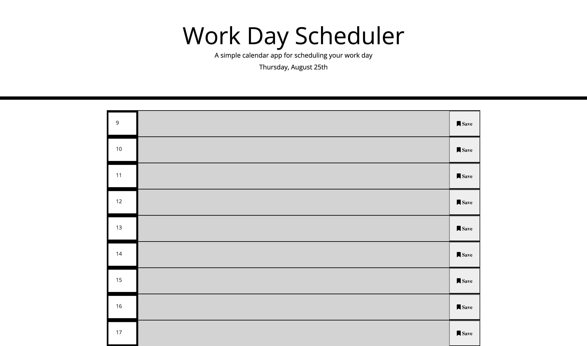

# workday-scheduler
## Description
[workday-scheduler](https://will-dean5.github.io/workday-scheduler/)

This is a workday scheduler that allows you to type in the text area and hit the save button to the right of it and it will save what you have typed in the text area. depending on what time it is the background color of the text area will change. If it is the current hour the text area will be red if it is a future hour it will be green and if it is a past hour it will be light grey. If you enter something in the text area and hit the save icon it will stay there even if you refresh the page. If you delete the text and hit save it will go away. 

## Image of Webpage
